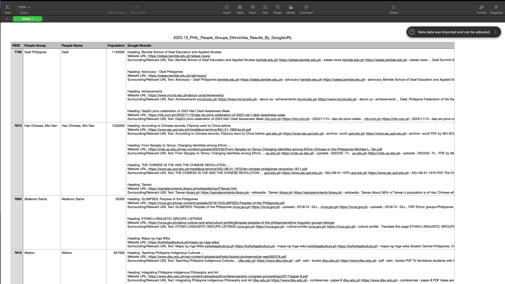

# Web Scraping - Automating Search Results

- Automating google search results

Based on Java JSoup Library - Alternative to Python BeautifulSoup (Can be translated to each other with some work)
JSoup Library: https://jsoup.org/

Setup Eclipse IDE or other Java supported IDE: https://eclipseide.org/

"google_search_automation_useragents_webdriver" uses Selenium Webdriver to automate the connection/gathering of different URLs and Google Search Results Data. Additionally, this implementation incorporates UserAgent rotation to minimize the chances of running into issues such as sending too many requests at once and getting CAPTCHA blockage requests as Google may think you are bot. Selenium webdriver: https://www.selenium.dev/documentation/
You want to ensure you understand how to setup a Maven project in order to set up all the dependencies in the pom.xml file. This approach can be time consuming and resource extensive as it opens a new browser for each search. 

When you run the code it may say "Error StatusLogger, etc." Ignore this message, simply letting you know it is using default plug-ins to connect to website, etc.

Program will create both a CSV File and a TXT File with results of each search term's corresponding google results in an organized format. Sample use case results look like this:

"webscraper_searching_specific_websites_html" searches through a given list of websites, given input excel (.xlsx) file, and searches for each term in the excel file to determine whether the file exists in the html text from the home html text page of each URL's. Keep in mind some websites may have forbidden access codes such as Status Code: 403 among others which may be reasons why this type of approach may not result in getting the expected results despite being significantly faster than the approach mentioned previously. 

The approach taken can depend on the accessibility of the website/html, the flexibility in resource usage, among other factors. Need to keep in mind that the approaches may need some tweaking based on use cases and with rising security and website protocols certain methods may become less effective. 
